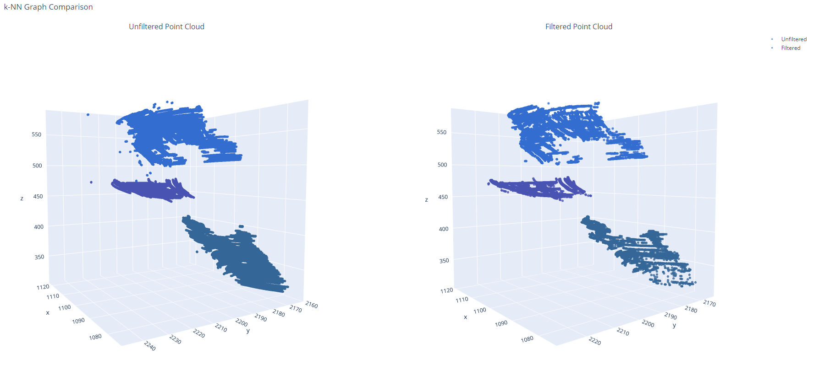

# DG-PPU

## Description

This repository contains the code to train a custom DGCNN segmentation model on 3D point cloud data and carry out post-processing to filter these point clouds from the k-regular graphs produced by the model.

For further information, please contact [Karthik Saravanan](mailto:karthik.saravanan@queens.ox.ac.uk) and [Injune Hwang](mailto:injune.hwang.geo37@gmail.com)

### Install dependencies

- numpy
- pandas
- matplotlib
- seaborn
- scikit-Learn
- Pytorch Geometric
- plotly

### Usage instructions

Follow these steps to run this code locally on your PC

- **Download required dependencies** and **clone this repository** to replicate the directory tree onto your local PC
- **Prepare your dataset:** ensure your point cloud dataset files are .csv files with four columns: 'x', 'y', 'z', 'label' to be properly loaded by utils/dataset.py. Enter the path to your dataset files under "root" in config.yaml
- **Setup wandb logging:** enter your api-key, project-name and run-name in a config.yaml file (this will enable you to log your model performance metrics onto an online wandb account for every epoch of training)
- _Alternatively, remove all wandb logging code before running train.py_
- **Run train.py:** contains example code used to train DGCNN model on a point cloud dataset (NOT INCLUDED IN REPOSITORY). trained_model.pth will be saved in /outputs/trained_models (USE THE SAME DIRECTORY STRUCTURE AS example_outputs)
- **Run post_processing.py:** contains post-processing code that will load your trained_model.pth file, run model predictions on a test dataset, and filter the model predictions using the k-regular graphs produced by DGCNN.
- **Outputs:** The filtered point cloud arrays, interactive point cloud plots, confusion matrices, and k-regular graph plot will all be saved into their respective subdirectory within /outputs

### License

MIT License

### Acknowledgement

The methods in this codebase are based upon [dgcnn](https://github.com/WangYueFt/dgcnn)
